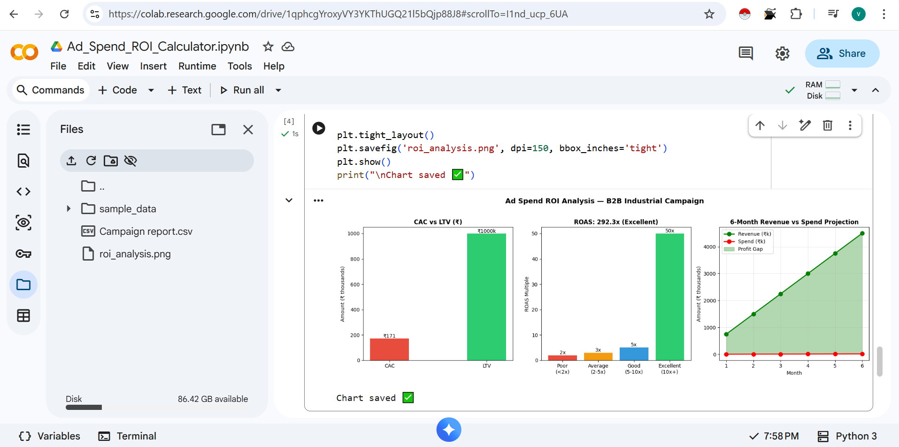

#  Ad Spend ROI Calculator
### Python · CAC · LTV · ROAS · Payback Period · Real B2B Data

A Python tool that takes raw Google Ads data and answers one question:

**"For every rupee I spend on ads — how much am I getting back?"**

---

## 📊 Results From Real Campaign Data (July 2025)

| Metric | Result | Benchmark | Status |
|--------|--------|-----------|--------|
| Total Ad Spend | ₹2,565.93 | — | — |
| Total Leads | 15 | — | — |
| CAC | ₹171.06 | ₹300–500 | ✅ 66% below benchmark |
| LTV | ₹10,00,000 | — | — |
| LTV:CAC Ratio | 5,846x | 3x minimum | ✅ Exceptional |
| ROAS | 292.3x | 4–10x | ✅ Excellent |
| Payback Period | 0 months | <12 months | ✅ Instant |
| **Verdict** | **EXCELLENT ✅** | — | **Scale immediately** |

---

## 🧮 What Each Metric Means

**CAC — Cost to get one lead**
`₹2,565 spend ÷ 15 leads = ₹171 per lead`
Industry benchmark = ₹300–500. We are 66% cheaper.

**LTV — Revenue from one customer over their lifetime**
`₹5 lakh deal × 2 purchases = ₹10 lakh LTV`

**LTV:CAC Ratio — The most important B2B metric**
`₹10,00,000 ÷ ₹171 = 5,846x`
Anything above 3x is healthy. We are at 5,846x.

**ROAS — Return on every ₹1 spent**
`Estimated revenue ÷ total spend = 292x`
For every ₹1 spent on ads → ₹292 in potential revenue.

**Payback Period — How fast does spend pay back?**
`Result: 0 months — instant ROI`

---

## 📈 Charts



3 charts generated automatically:
- CAC vs LTV comparison
- ROAS benchmark (Poor → Average → Good → Excellent)
- 6-month revenue vs spend projection

---

## 🔑 Key Insight

₹2,566 in ad spend → 15 leads → potential ₹7.5 lakh revenue.

**But 1,934 people clicked the ad. Only 15 converted (0.78%).**

The ad is working. The landing page is not.
Fix conversion rate from 0.78% → 2% and leads double
with zero extra ad spend.

---

## 🚀 How to Run

1. Open [Google Colab](https://colab.research.google.com)
2. Upload `Campaign report.csv`
3. Open `Ad_Spend_ROI_Calculator.ipynb`
4. Click `Runtime → Run All`

**To use with your own data — change these 3 values in Cell 2:**
```python
AVG_DEAL_VALUE = 500000        # your average deal value in ₹
CLOSE_RATE = 0.10              # % of leads that become customers
AVG_PURCHASES_PER_CUSTOMER = 2 # how many times one customer buys
```

---

## 🛠 Tools Used

| Tool | Purpose |
|------|---------|
| Python (Pandas) | Data cleaning and calculations |
| Matplotlib | ROI charts |
| Google Colab | Development environment |

---

## 📁 Files

```
ad-spend-roi-calculator/
├── Ad_Spend_ROI_Calculator.ipynb  # Main notebook
├── Campaign report.csv            # Raw Google Ads data
├── roi_analysis.png               # ROI charts
└── README.md
```

---

## 📁 Related Projects

- [Campaign Performance Analyzer](https://github.com/VishalMotling/campaign-performance-analyzer) — Python + SQL · SCALE/MONITOR/PAUSE scoring
- [B2B Marketing Funnel Dashboard](https://lookerstudio.google.com/reporting/0212f153-d4b7-4649-919a-273aaa09ac2b) — GA4 + Looker Studio

---

## 👤 About

**Vishal Mahendra Motling** — Digital Marketing Executive
Targeting Performance Marketing + Analytics roles at B2B SaaS companies.

📧 vishalmotling8@gmail.com · 📍 Pune, Maharashtra

---

*All data is real. July 2025 campaign numbers. Nothing fabricated.*
